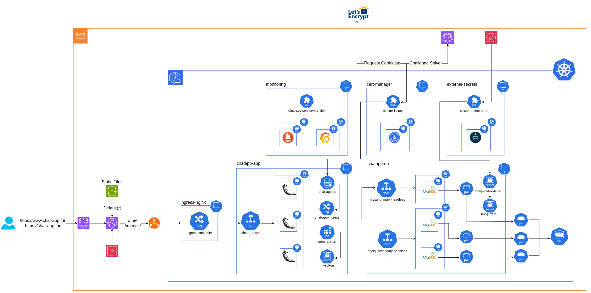

# Chat application

A modern, real-time chat application built with Flask and Docker. Features room-based conversations, username management, and a sleek responsive UI.

## Features

- **Room-based Chat** - Create and join different chat rooms
- **Username Management** - Change your display name on the fly
- **Real-time Updates** - Messages appear automatically every 2 seconds
- **Responsive Design** - Works perfectly on desktop and mobile
- **Chat Management** - Clear room history with one click
- **Security** - XSS protection and input validation
- **Dockerized** - Complete containerized deployment with Nginx and MySQL

## Architecture

```
┌─────────────┐    ┌─────────────┐    ┌─────────────┐
│    Nginx    │    │    Flask    │    │    MySQL    │
│  (Frontend) │◄──►│  (Backend)  │◄──►│ (Database)  │
│    :80      │    │    :5000    │    │   :3306     │
└─────────────┘    └─────────────┘    └─────────────┘
```



## Quick Start

### Prerequisites

- Docker and Docker Compose
- Git

### Installation

1. **Clone the repository**

   ```bash
   git clone https://gitlab.com/bootcamp1531414/portfolio-application.git
   cd chatapp
   ```

2. **Set up environment variables**

   ```bash
   cp .app.env.example .app.env
   ```

   Edit `.app.env` with your MySQL credentials:

   ```env
   MYSQL_ROOT_PASSWORD=your_root_password
   MYSQL_USER=chatapp_user
   MYSQL_PASSWORD=your_password
   MYSQL_DATABASE=chatapp_db
   MYSQL_HOST=mysql
   MYSQL_URI=${MYSQL_USER}:${MYSQL_PASSWORD}@${MYSQL_HOST}:3306/${MYSQL_DATABASE}
   ```

3. **Start the application**

   ```bash
   docker compose --profile app up -d --build
   ```

4. **Access the chat**
   Open your browser and navigate to `http://localhost`

## Project Structure

```
chatapp/
├── app/
│   ├── app.py              # Flask application factory
│   ├── models.py           # Database models
│   ├── routes.py           # API endpoints
│   └── run.py              # Application entry point
├── static/
│   ├── index.html          # Frontend HTML
│   ├── metrics-viewer.html # Metrics frontend
│   ├── styles.css          # Styling
│   └── app.js              # Frontend JavaScript
├── tests/
│   ├── run_tests.py        # Test runner script
│   ├── test_config.py      # Configuration tests
|   ├── test_e2e.py         # E2E API tests
│   ├── test_metrics.py     # Metrics endpoint tests
│   ├── test_models.py      # Database model tests
│   └── test_routes.py      # API endpoint tests
├── docker/
│   ├── Dockerfile          # Chat app container
│   ├── Dockerfile.nginx    # NGINX container
│   └── Dockerfile.test     # Testing container
├── conf/
│   └── nginx.conf          # Nginx configuration
├── Jenkinsfile             # Main CI for app
├── compose.yaml            # Docker Compose configuration
├── pytest.ini              # Pytest configuration
├── requirements.txt        # Python dependencies
├── requirements-test.txt   # Testing dependencies
└── .app.env.example        # Environment variables template
```

## API Endpoints

### Chat Operations

All chat operations use the same endpoint with different HTTP methods:

**Base URL:** `/api/chat/<room>`

| Method   | Purpose               | Parameters                     |
| -------- | --------------------- | ------------------------------ |
| `GET`    | Retrieve all messages | None                           |
| `POST`   | Send new message      | `username`, `msg`              |
| `PUT`    | Update username       | `old_username`, `new_username` |
| `DELETE` | Clear chat history    | None                           |

### Metrics Endpoint

**URL:** `/metrics`

| Method | Purpose                 | Response                                              |
| ------ | ----------------------- | ----------------------------------------------------- |
| `GET`  | Get application metrics | JSON with usage stats, system health, top users/rooms |

### Health Check Endpoint

**URL:** `/health`

| Method | Purpose                  | Response                                          |
| ------ | ------------------------ | ------------------------------------------------- |
| `GET`  | Check application health | JSON with system status and database connectivity |

### Example Usage

**Send a message:**

```bash
curl -X POST http://localhost/api/chat/general \
  -d "username=john" \
  -d "msg=Hello World!"
```

**Change username:**

```bash
curl -X PUT http://localhost/api/chat/general \
  -d "old_username=john" \
  -d "new_username=john_doe"
```

**Clear chat:**

```bash
curl -X DELETE http://localhost/api/chat/general
```

**Get metrics:**

```bash
curl -X GET http://localhost/metrics
```

**Health check:**

```bash
curl -X GET http://localhost/health
```

## Usage

1. **Join a Room**

   - Enter a room name (e.g., "general", "random")
   - Choose your username
   - Press Enter or click "Join Room"

2. **Chat Features**

   - Type messages and press Enter to send
   - Messages appear in real-time
   - Automatic scrolling to newest messages

3. **Username Management**

   - Click "Change Name" to update your display name
   - All your previous messages will show the new name

4. **Room Management**
   - "Clear Chat" removes all messages in the room
   - "Leave Room" returns you to the join screen

## Testing

The application includes a comprehensive test suite with 35+ tests covering all functionality.

### Test Structure

- **Model Tests** (`test_models.py`) - Database operations and model validation
- **Route Tests** (`test_routes.py`) - API endpoint functionality and error handling
- **Config Tests** (`test_config.py`) - Application configuration and setup
- **Metrics Tests** (`test_metrics.py`) - Metrics endpoint validation
- **E2E Tests** (`test_e2e.py`) - End-to-end workflow testing

### Running Tests

**Unit Tests:**

```bash
docker compose run --build unit-test
```

**Live E2E Testing:**

Test against a running application instance:

```bash
# Start application stack
docker compose --profile app up -d --build

# Run E2E tests
docker compose run --build e2e-test
```

### Test Features

- **Isolated Environment** - Uses in-memory SQLite database
- **No External Dependencies** - Tests run independently of Docker stack
- **Fast Execution** - Complete test suite runs in under 1 second
- **Comprehensive Coverage** - Tests all API endpoints, models, and error conditions
- **CI/CD Ready** - Perfect for automated testing pipelines

## Configuration

### Environment Variables

| Variable              | Description                         | Required |
| --------------------- | ----------------------------------- | -------- |
| `MYSQL_ROOT_PASSWORD` | MySQL root password                 | Yes      |
| `MYSQL_USER`          | Application database user           | Yes      |
| `MYSQL_PASSWORD`      | Application user password           | Yes      |
| `MYSQL_DATABASE`      | Database name                       | Yes      |
| `MYSQL_HOST`          | MySQL host (use `mysql` for Docker) | Yes      |
| `MYSQL_URI`           | Flask mysql uri connecting string   | Yes      |

### Nginx Configuration

The app uses Nginx as a reverse proxy:

- Static files served directly by Nginx
- API requests proxied to Flask app
- Configured for single-page application routing

## Health Checks

The application includes comprehensive health checks for all services:

### MySQL

- **Check**: `mysql -u ${MYSQL_USER} -p${MYSQL_PASSWORD} -e 'SELECT 1'`
- **Verifies**: Database connectivity and authentication

### Flask Application

- **Check**: HTTP request to `/health` endpoint
- **Verifies**: Application running and database connectivity

### Nginx

- **Check**: HTTP request to main page (`/`)
- **Verifies**: Static file serving and proxy functionality

````

## Database Schema

```sql
CREATE TABLE chat (
    id INT PRIMARY KEY AUTO_INCREMENT,
    room VARCHAR(50) NOT NULL,
    date VARCHAR(50) NOT NULL,
    time VARCHAR(50) NOT NULL,
    username VARCHAR(50) NOT NULL,
    message TEXT NOT NULL
);
````

---

Built with Flask, Docker, and modern web technologies.
