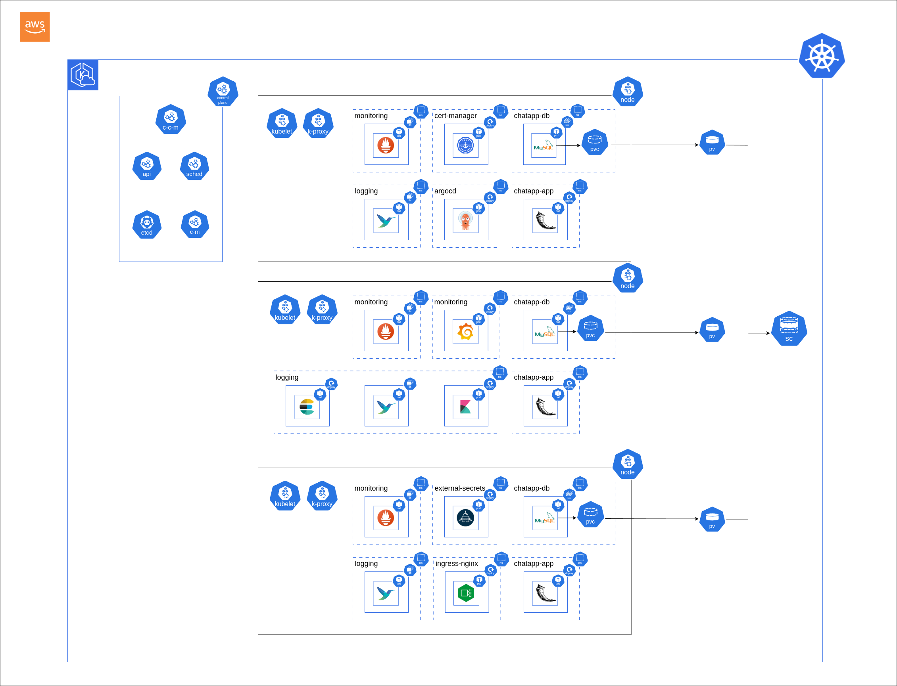

# Chat App Portfolio - GitOps Repository

A production-ready chat application deployed on Kubernetes using GitOps principles with ArgoCD, featuring comprehensive logging, monitoring, and security.

## Architecture Overview

This repository implements a **GitOps workflow** using ArgoCD to manage both infrastructure and application deployments across multiple Kubernetes namespaces.



### Components

- **Chat Application**: Flask chat app with MySQL backend
- **Infrastructure**: Core Kubernetes services (Ingress, Cert-Manager, Logging)
- **Monitoring**: Prometheus integration with ServiceMonitor
- **Security**: TLS certificates via Let's Encrypt, AWS Secrets Manager integration

## Repository Structure

```
├── chat-app/
│   ├── app/
│   │   ├── Chart.yaml
│   │   ├── templates/
│   │   └── values.yaml
│   └── chat-app.yaml
├── chat-app-parent.yaml       # App of Apps for chat-app
├── infra-app/
│   ├── cert-manager/
│   │   ├── Chart.yaml
│   │   ├── templates/
│   │   │   └── cluster-issuers.yaml
│   │   └── values.yaml
│   ├── cert-manager-app.yaml
│   ├── elastic-search/
│   │   ├── Chart.yaml
│   │   ├── templates/
│   │   │   └── external-secret.yaml
│   │   └── values.yaml
│   ├── elasticsearch-app.yaml
│   └── ingress-nginx-app.yaml
└── infra-app-parent.yaml      # App of Apps for infrastructure
```

## Quick Start

### Prerequisites

- Kubernetes cluster with ArgoCD installed
- AWS Secrets Manager configured
- Route53 DNS management
- Container registry access (ECR)

### Deployment

1. **Deploy Infrastructure Components**:

   ```bash
   kubectl apply -f infra-app/infra-app-parent.yaml
   ```

2. **Deploy Chat Application**:
   ```bash
   kubectl apply -f chat-app/chat-app-parent.yaml
   ```

### Sync Waves Order

The deployment follows this sequence using ArgoCD sync waves:

1. **Wave -5**: Namespaces
2. **Wave -4**: External Secrets
3. **Wave -3**: RBAC (ServiceAccounts, Roles)
4. **Wave -2**: Ingress Controller, URI Generation Job
5. **Wave -1**: Cert-Manager, Elasticsearch credentials
6. **Wave 0**: MySQL database
7. **Wave 1**: Fluent-bit logging
8. **Wave 2**: Let's Encrypt ClusterIssuer
9. **Wave 3**: Chat application deployment

## Key Features

### Security

- **TLS Termination**: Automatic SSL certificates via Let's Encrypt
- **Secret Management**: AWS Secrets Manager integration with External Secrets Operator

### Observability

- **Logging**: ELK stack (Elasticsearch + Kibana + Fluent-bit)
- **Monitoring**: Prometheus ServiceMonitor integration
- **Health Checks**: Readiness and liveness probes

### High Availability

- **Rolling Updates**: Zero-downtime deployments
- **Resource Management**: CPU/memory limits and requests
- **Auto-healing**: ArgoCD self-heal and pruning enabled

## Access Points

- **Chat App**: `https://chat-app.fun`
- **Alternative URL**: `https://www.chat-app.fun`
- **Kibana Dashboard**: Port-forward to access log dashboard
  ```bash
  kubectl port-forward -n logging svc/kibana 5601:5601
  ```
- **Grafana Dashboard**: Port-forward to access monitoring dashboard
  ```bash
  kubectl port-forward -n monitoring svc/grafana 3000:3000
  ```

## Application Configuration

### Environment

- **Namespace**: `chatapp-app` (application), `chatapp-db` (database)
- **Replicas**: 2 (configurable)
- **Image**: `ECR stored docker images`
- **Database**: MySQL with replication architecture

### Resource Defaults

```yaml
requests:
  cpu: 250m
  memory: 256Mi
limits:
  cpu: 1
  memory: 512Mi
```

## GitOps Workflow

1. **Code Changes**: Push to GitLab repository
2. **ArgoCD Sync**: Automatic detection and deployment
3. **Health Monitoring**: Continuous application health checks
4. **Auto-healing**: Automatic drift correction

## Customization

### Application Settings

Modify `chat-app/app/values.yaml`:

- Replica count
- Resource limits
- Custom labels
- Ingress configuration

### Infrastructure Settings

Update respective `values.yaml` files in `infra-app/` directories for:

- Elasticsearch configuration
- Cert-manager settings
- Ingress controller parameters

## Labels & Selectors

Standard labels applied across all resources:

- `app`: Application identifier
- `env`: Environment (prod)
- `developer`: erik
- `tier`: Component tier (app, db, monitoring, etc.)

---

**Note**: This is a portfolio project demonstrating modern Kubernetes deployment patterns with GitOps methodology.
