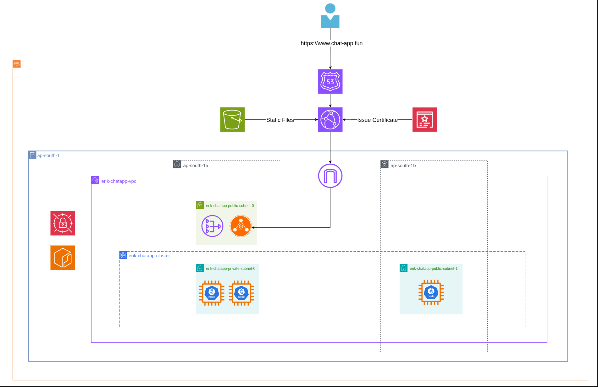

# EKS Terraform Infrastructure

A comprehensive Terraform project for deploying a production-ready Amazon EKS cluster with essential applications and infrastructure components on AWS.

## Architecture Overview

This infrastructure creates:

- **VPC** with public/private subnets across multiple AZs
- **EKS Cluster** (v1.33) with managed node groups
- **IAM Roles** for cluster, nodes, and service accounts
- **OIDC Provider** for service account authentication
- **Essential Applications** via Helm: ArgoCD, External Secrets, Prometheus Stack



## Quick Start

```bash
# Clone and navigate to project
cd eks-terraform-infrastructure

# Initialize Terraform
terraform init

# Plan deployment
terraform plan -var-file="vars.tfvars"

# Deploy infrastructure
terraform apply -var-file="vars.tfvars"
```

## Project Structure

```
.
├── main.tf                     # Root module orchestration
├── variables.tf                # Input variables
├── outputs.tf                  # Output values
├── provider.tf                 # Provider configurations
├── vars.tfvars                 # Variable values
├── modules/
│   ├── network/               # VPC, subnets, routing
│   ├── iam/                   # IAM roles and policies
│   ├── cluster/               # EKS cluster and node groups
│   ├── oidc/                  # OIDC provider and service roles
│   └── helm-kubernetes/       # Kubernetes resources and Helm charts
└── helm-values/               # Helm chart configurations
    ├── argocd-values.yaml
    ├── external-secrets-values.yaml
    └── kube-prometheus-stack-values.yaml
```

## Modules

### Network Module

- Creates VPC with configurable CIDR blocks
- Public subnet with Internet Gateway
- Private subnets with NAT Gateway
- Route tables and associations

### IAM Module

- EKS cluster service role
- Node group instance role
- AWS managed policy attachments

### Cluster Module

- EKS cluster with API authentication mode
- Managed node group (t3a.medium instances)
- Cluster addons: VPC CNI, CoreDNS, Kube-proxy, EBS CSI driver
- User access entry with admin permissions

### OIDC Module

- OIDC identity provider for service account authentication
- IAM roles for:
  - EBS CSI Driver
  - External Secrets Operator
  - Cert-manager (Route53 DNS challenge)

### Helm-Kubernetes Module

- **ArgoCD**: GitOps continuous delivery
- **External Secrets**: AWS Secrets Manager integration
- **Kube-Prometheus-Stack**: Monitoring and alerting
- Custom storage class (GP3)
- Service accounts with IAM role annotations

## Configuration

### Key Variables

| Variable            | Description                    | Default         |
| ------------------- | ------------------------------ | --------------- |
| `region`            | AWS region                     | `ap-south-1`    |
| `naming_prefix`     | Resource naming prefix         | `erik-chatapp`  |
| `access_entry_user` | IAM user for cluster access    | -               |
| `vpc_config`        | VPC and subnet configuration   | See vars.tfvars |
| `eks_config`        | EKS scaling and addon settings | See vars.tfvars |

### Customization

Edit `vars.tfvars` to modify:

- VPC CIDR blocks and subnets
- EKS node group scaling (min: 3, max: 3, desired: 3)
- Helm chart versions
- Resource tags

## Deployed Applications

### ArgoCD

- **Namespace**: `argocd`
- **Purpose**: GitOps continuous delivery
- **Access**: Configured for insecure mode (internal use)
- **Features**: GitLab repository integration via External Secrets

### External Secrets Operator

- **Namespace**: `external-secrets`
- **Purpose**: Sync secrets from AWS Secrets Manager
- **IAM**: Service account with SecretsManager permissions
- **Configuration**: ClusterSecretStore for namespace-wide access

### Kube-Prometheus-Stack

- **Namespace**: `monitoring`
- **Components**: Prometheus, Grafana, AlertManager
- **Purpose**: Cluster monitoring and alerting
- **Resources**: Optimized for cost-effective monitoring

## Prerequisites

- AWS CLI configured with appropriate permissions
- Terraform >= 1.0
- kubectl (for post-deployment management)
- IAM user specified in `access_entry_user` variable

## Post-Deployment

### Access Cluster

```bash
aws eks update-kubeconfig --region ap-south-1 --name erik-chatapp-cluster
```

### Verify Applications

```bash
kubectl get pods -n argocd
kubectl get pods -n external-secrets
kubectl get pods -n monitoring
```

### ArgoCD Access

```bash
kubectl port-forward svc/argocd-server -n argocd 8080:443
# Access: https://localhost:8080
# Default admin password is configured in values
```

## Security Features

- Private subnets for worker nodes
- OIDC-based service account authentication
- Encrypted EBS volumes (GP3)
- IAM roles with least-privilege permissions
- Secrets managed via AWS Secrets Manager

## Cost Optimization

- T3a.medium instances
- Resource limits configured for all applications
- Node affinity to avoid larger instance types
- EBS GP3 storage for better price/performance

## Cleanup

```bash
terraform destroy -var-file="vars.tfvars"
```

**Note**: Ensure all LoadBalancer services and persistent volumes are removed before destroying infrastructure to avoid orphaned AWS resources.

## Support

For issues or questions, refer to the individual module documentation or check the Terraform plan output for resource-specific configurations.
